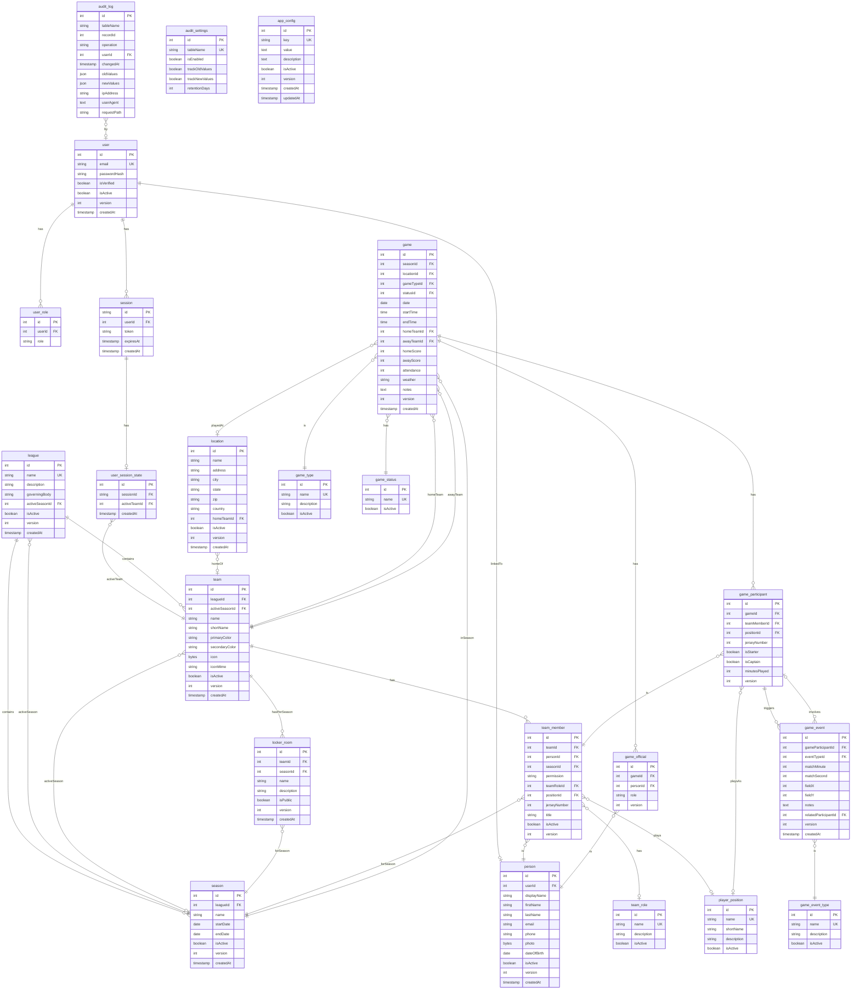

# DoubleZero Database Schema (v2 - Season-Aware)

## Overview

- **Permission Model:** ADMIN (system) | TEAM_ADMIN | TEAM_MEMBER
- **Soft Delete:** All entities use `isActive` boolean
- **Optimistic Locking:** All entities have `version` field

---

## Entity Relationship Diagram

---

## Seed Data

The following lookup tables are pre-populated by the seed script.

### team_role

| name | description |
|------|-------------|
| Head Coach | Head coach of the team |
| Assistant Coach | Assistant coach |
| Goalkeeper Coach | Specialized goalkeeper coach |
| Manager | Team manager |
| Player | Team player |
| Goalkeeper | Team goalkeeper |
| Parent | Parent or guardian of a player |
| Volunteer | Team volunteer |

### player_position

| name | shortName | description |
|------|-----------|-------------|
| Goalkeeper | GK | Goalkeeper |
| Right Back | RB | Right defender |
| Left Back | LB | Left defender |
| Center Back | CB | Central defender |
| Defensive Midfielder | CDM | Defensive midfielder |
| Central Midfielder | CM | Central midfielder |
| Attacking Midfielder | CAM | Attacking midfielder |
| Right Midfielder | RM | Right midfielder |
| Left Midfielder | LM | Left midfielder |
| Right Winger | RW | Right winger |
| Left Winger | LW | Left winger |
| Striker | ST | Center forward / Striker |
| Center Forward | CF | Center forward |

### game_type

| name | description |
|------|-------------|
| League | Regular league match |
| Friendly | Friendly / exhibition match |
| Tournament | Tournament match |
| Cup | Cup competition match |
| Playoff | Playoff match |
| Scrimmage | Practice scrimmage |

### game_status

| name |
|------|
| Scheduled |
| In Progress |
| Completed |
| Cancelled |
| Postponed |
| Forfeit |

### game_event_type

| name | description |
|------|-------------|
| Goal | Goal scored |
| Own Goal | Own goal |
| Assist | Goal assist |
| Yellow Card | Yellow card issued |
| Red Card | Red card issued |
| Second Yellow | Second yellow card (red) |
| Substitution In | Player substituted in |
| Substitution Out | Player substituted out |
| Injury | Player injury |
| Penalty Kick | Penalty kick awarded |
| Penalty Scored | Penalty kick scored |
| Penalty Missed | Penalty kick missed |
| Penalty Saved | Penalty kick saved |
| Free Kick | Free kick awarded |
| Corner Kick | Corner kick |
| Offside | Offside called |
| Foul | Foul committed |
| Shot on Target | Shot on target |
| Shot off Target | Shot off target |
| Save | Goalkeeper save |
| Timeout | Timeout called |
| Half Time | Half time |
| Full Time | Full time |
