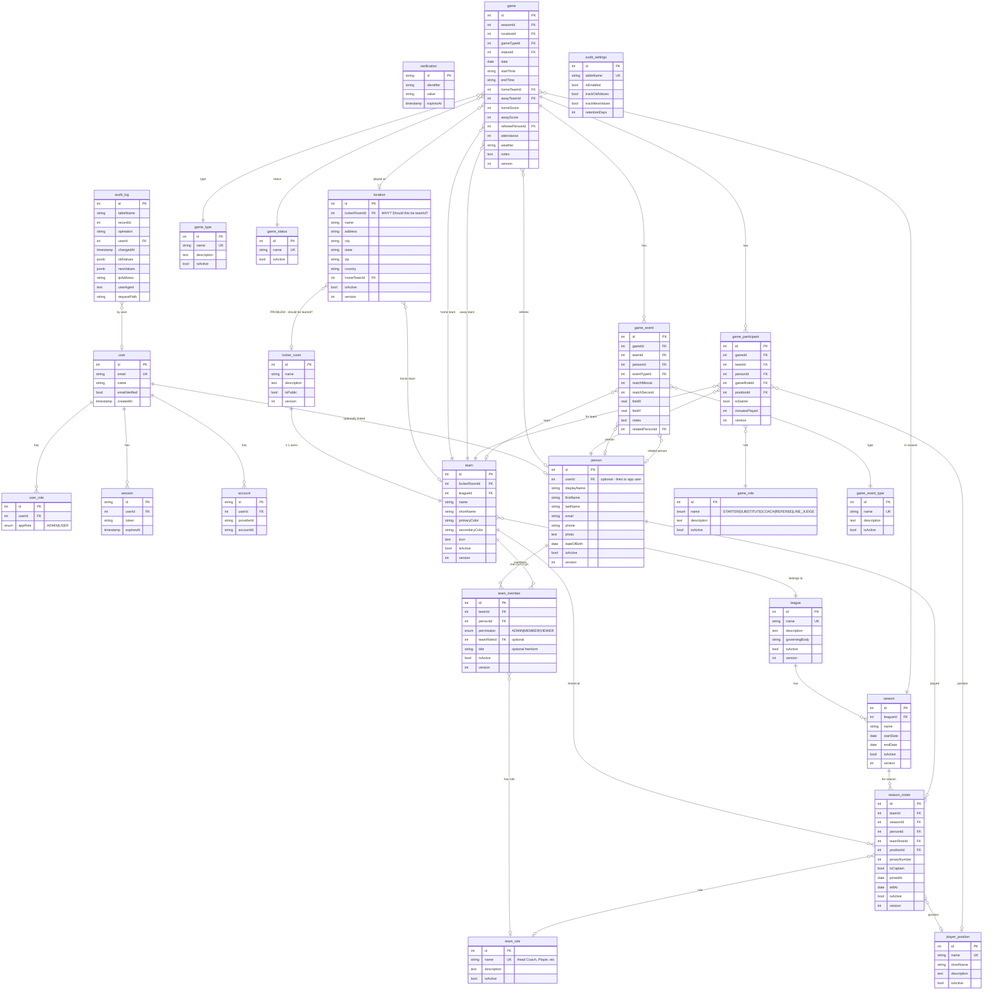

# DoubleZero Database Schema Diagram

Generated to help visualize current table relationships.

## Issues Identified

### 1. `location.locker_room_id` - **WRONG**
Locations are physical places (fields, stadiums). They should NOT reference locker_room (a virtual team workspace).

**Options:**
- A) Remove `locker_room_id` entirely - locations are global/shared
- B) Replace with `team_id` - if locations should be "owned" by a team
- C) Keep both `team_id` (owner) and `home_team_id` (default home team)

### 2. Schema looks reasonable otherwise
- `team` → `locker_room` (1:1) ✅
- `team_member` for permissions ✅  
- `season_roster` for historical data ✅
- `person` no longer has `locker_room_id` ✅

## Recommendation

For `location`:
- Remove `locker_room_id`
- Keep `home_team_id` (which team plays home games here)
- Optionally add `owner_team_id` if you want team-specific locations
